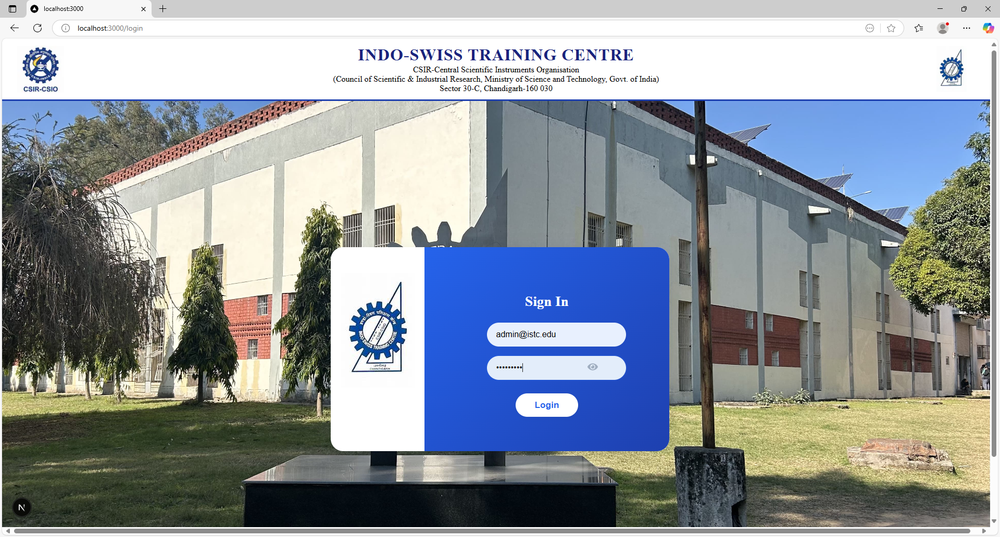
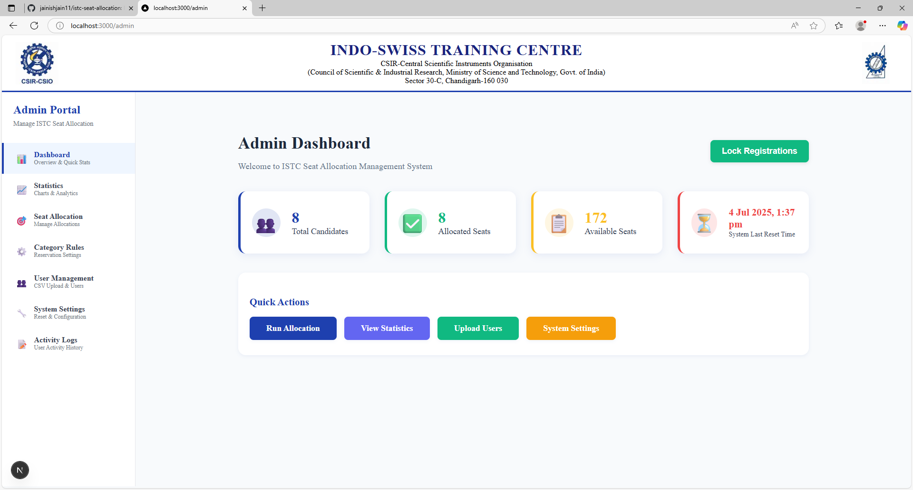
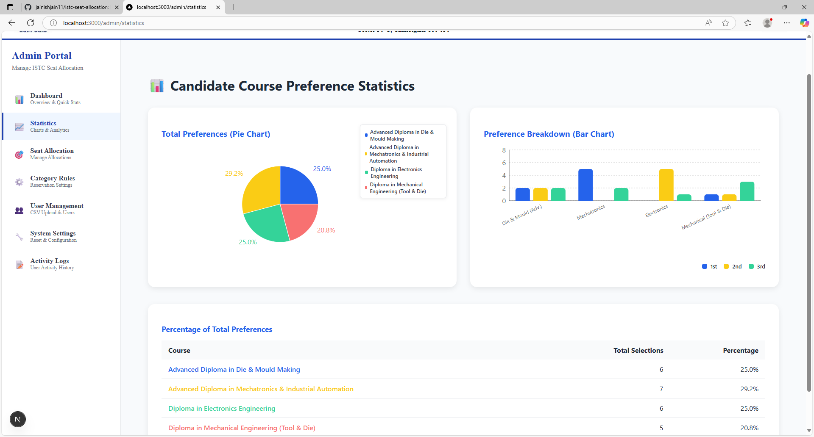

<div align="center">
  
  
  
  
  
  
</div>

<h1 align="center">ISTC Seat Allocation Portal</h1>

<p align="center">
  <b>Modern, Secure, and Automated Seat Allocation System for ISTC Admissions</b>
</p>

<p align="center">
  
  
  
  
  
</p>

---

## 🚀 Overview

The **ISTC Seat Allocation Portal** is a modern, full-stack web application for managing candidate admissions, seat allocation, and document verification for Indo-Swiss Training Centre. It features a secure admin dashboard, real-time seat matrix, automated PDF allocation letters, and a seamless candidate experience.

---

## 🛠️ Tech Stack

| Technology   | Logo | Description |
|--------------|------|-------------|
| Next.js      |  | React-based full-stack framework for SSR, routing, and API integration |
| TypeScript   |  | Strongly-typed JavaScript for scalable, maintainable code |
| Node.js      |  | Backend runtime for server-side logic and APIs |
| MySQL        |  | Relational database for secure data storage |
| React        |  | UI library for dynamic, component-driven frontend |
| PDFKit       |  | PDF generation for allocation letters |
| CSS Modules  |  | Modular, maintainable CSS styling |
| Docker       |  | (Optional) Containerized deployment |

---

## ✨ Features

- **Admin Dashboard**: Manage seat allocation, publish results, and set document verification dates.
- **Automated Seat Allocation**: Fair, reservation-compliant algorithm with real-time updates.
- **Candidate Portal**: Personalized results, PDF allocation letter download, and next-step guidance.
- **PDF Allocation Letters**: Professionally branded, instant generation with ISTC header/footer.
- **Responsive Design**: Works beautifully on desktop and mobile.
- **Secure**: Role-based access, input validation, and protected API endpoints.
- **Export/Import**: Admin can export candidate data in CSV format.
- **Modern UI**: Clean, creative, and user-friendly interface.

---

## 📦 Folder Structure

src/
app/
admin/ # Admin dashboard & management
candidate/ # Candidate result and download pages
api/ # All backend API routes
components/ # Reusable React components
lib/ # Database and utility libraries
public/images/ # Logos and static assets
styles/ # CSS Modules

---

## 📝 Getting Started

1. **Clone the Repository**
```
git clone https://github.com/your-repo/istc-seat-allocation.git
cd istc-seat-allocation
```

2. **Install Dependencies**
```
npm install
```

3. **Configure Environment**
- Copy `.env.example` to `.env` and fill in your DB credentials and config.

4. **Run Database Migrations**
Use your preferred migration tool or run SQL scripts in /migrations

5. **Start the Development Server**
```
npm run dev
```

6. **Access the App**
- Login page : `http://localhost:3000/`
- Admin Dashboard: `http://localhost:3000/admin`
- Candidate Portal: `http://localhost:3000/candidate/[userId]/results`

---

## 📄 Sample Screenshots

<div align="center">




---


<div align="center">


</div>
