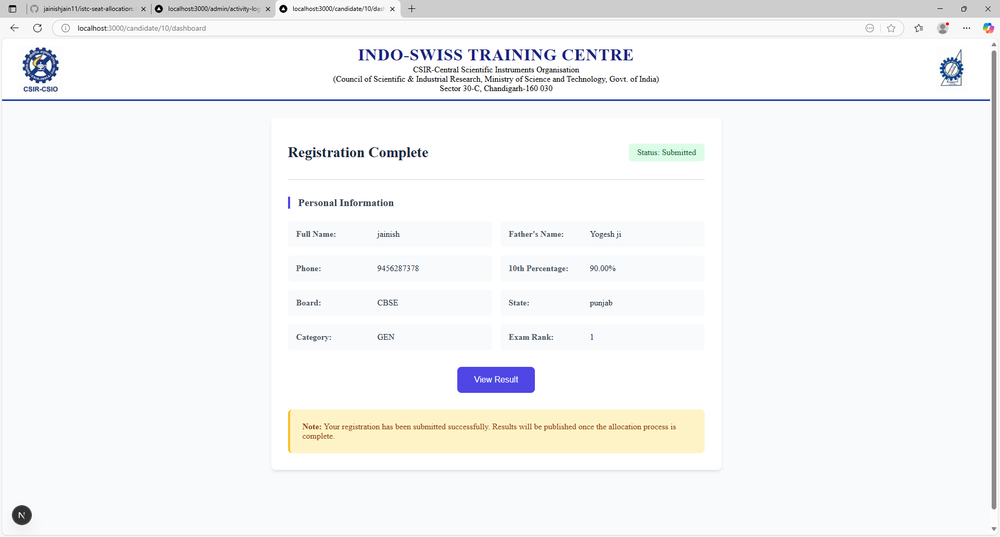

<div align="center">
  
  
  
  
  
  
</div>

<h1 align="center">ISTC Seat Allocation Portal</h1>

<p align="center">
  <b>Modern, Secure, and Automated Seat Allocation System for ISTC Admissions</b>
</p>

<p align="center">
  
  
  
  
  
</p>

---

## 🚀 Overview

The **ISTC Seat Allocation Portal** is a full-stack web application designed to manage online seat allocation, admission tracking, and document verification processes for the **Indo-Swiss Training Centre (ISTC)**.

It supports admins and candidates with real-time seat matrix management, automated allocation, document uploads, and secure PDF allocation letters.

---

## 🛠️ Tech Stack

## 🛠️ Tech Stack

| Technology   | Logo                                                                 | Description                                                             |
|--------------|----------------------------------------------------------------------|-------------------------------------------------------------------------|
| **Next.js**  |  | React-based full-stack framework for SSR, routing, and API integration |
| **TypeScript** |  | Strongly-typed JavaScript for scalable, maintainable code              |
| **Node.js**  |  | Backend runtime for server-side logic and APIs                         |
| **MySQL**    |  | Relational database for secure data storage                            |
| **React**    |  | UI library for dynamic, component-driven frontend                      |
| **PDFKit**   | 📄 | PDF generation for allocation letters                                  |
| **CSS Modules** |  | Modular, maintainable CSS styling                                      |
| **Docker**   |  | Containerized deployment                                               |


---

## ✨ Features

- 🔐 **Admin Dashboard** – Manage allocations, preferences, verification, and export CSVs.
- 🧠 **Automated Seat Allocation** – Fair & reservation-based algorithm.
- 🧑‍🎓 **Candidate Portal** – View results, download allocation letters, see next steps.
- 📄 **PDF Generation** – Branded, auto-generated allocation letters with PDFKit.
- 📱 **Responsive Design** – Fully functional on desktop and mobile.
- 🔒 **Role-Based Access** – Secure APIs and user-level restrictions.
- ⬇️ **CSV Import/Export** – Admin-friendly data portability.
- 💡 **Modern UI/UX** – Clean, fast, and intuitive interface.

---

## 📝 Getting Started

### 1. Clone the Repository

```bash
git clone https://github.com/your-username/istc-seat-allocation.git
cd istc-seat-allocation
```
### 2. Install Dependencies
```bash
npm install
```
### 3. Configure Environment
Copy the example file:
```bash
cp .env.example .env
```
Fill in the required MySQL credentials and config in .env

### 4. SetUp Database
Use SQL scripts in migrations/ or your migration tool of choice.

### 5. Start the Development Server
```bash
npm run dev
```

### 6. Access the Application
Login Page: http://localhost:3000/

Admin Panel: http://localhost:3000/admin

Candidate Results: http://localhost:3000/candidate/[userId]/results

## 📸 Sample Screenshots
<div align="center">     </div>

<div align="center"> Built using Next.js, TypeScript, and MySQL </div>

This is a repo made for making the ISTC Official Website.

